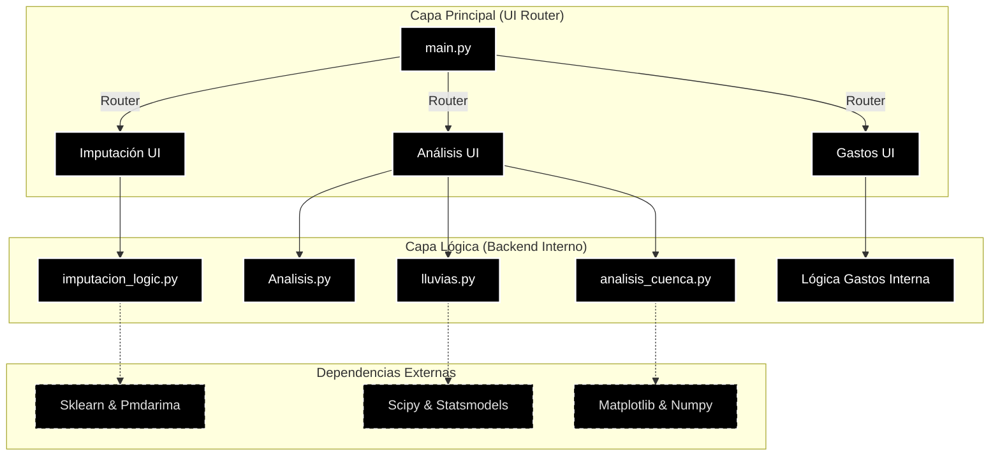
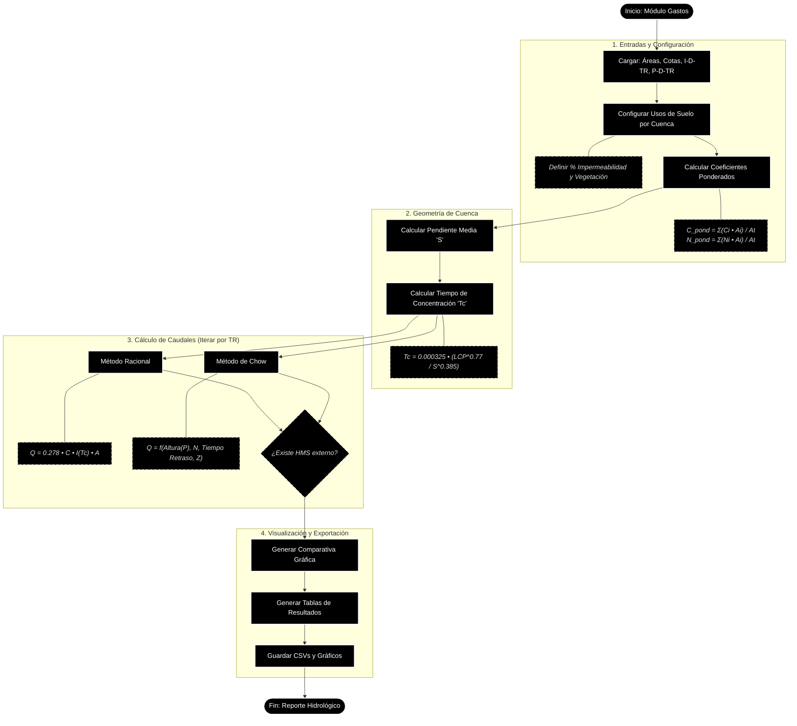

```mermaid
flowchart TD
    %% --- ESTILOS MINIMALISTAS (DARK MODE) ---
    classDef base fill:#000000,stroke:#ffffff,stroke-width:2px,color:#ffffff;
    classDef cond fill:#000000,stroke:#ffffff,stroke-width:2px,stroke-dasharray: 5 5,color:#e0e0e0;

    %% --- NODOS ---
    Start([Inicio: Cargar CSV Procesado])
    
    %% NOTA: Se añadieron comillas dobles "" a los títulos de los subgrafos para evitar el error
    subgraph Preprocesamiento ["1. Limpieza y Exploración"]
        direction TB
        Load[Analisis.procesar_datos]
        Filter{¿Aplicar Filtros C1/C2/C3?}
        Clean[Generar DataFrame Filtrado]
        Stats[Calc. Estadísticas Descriptivas]
        PlotsGen[Gráficos: Histograma, Series, Violin]
    end

    subgraph Modulo_Lluvias ["2. Análisis de Eventos (Lluvias)"]
        direction TB
        MaxAnual[Extraer Serie de Máximos Anuales]
        Tests[Pruebas: Homogeneidad, Anderson-Darling, ACF]
        Weibull[Posición de Graficación Weibull]
        Fit[Ajuste de Distribuciones Probabilísticas]
        BestFit{Selección Automática Mejor Ajuste}
    end

    subgraph Modulo_Cuenca ["3. Diseño Hidrológico (Cuenca)"]
        direction TB
        GetBest[Recibir 'Best Fit' + Máximos Mensuales]
        CalcParam[Calc. Parámetros Regionales a, b, c]
        GenIDF[Generar DataFrames Altura e Intensidad]
        PlotDesign[Graficar Curvas IDF y PDR + Zoom]
    end

    End([Fin: Exportar CSVs y PNGs])

    %% --- CONEXIONES ---
    Start --> Load
    Load --> Filter
    Filter -- Sí/No --> Clean
    Clean --> Stats
    Stats --> PlotsGen
    
    PlotsGen --> MaxAnual
    MaxAnual --> Tests
    Tests --> Weibull
    Weibull --> Fit
    Fit --> BestFit
    
    BestFit -- "Ej. Gumbel / Pearson III" --> GetBest
    GetBest --> CalcParam
    CalcParam --> GenIDF
    GenIDF --> PlotDesign
    PlotDesign --> End

    %% --- APLICACIÓN DE ESTILOS ---
    class Start,Load,Clean,Stats,PlotsGen,MaxAnual,Tests,Weibull,Fit,GetBest,CalcParam,GenIDF,PlotDesign,End base;
    class Filter,BestFit cond;
```

# HidroSystem_v5
Aplicación Python para el calculo hidrológico , imputación y análisis de cuencas, empleando ML
# 🐍💧 Sistema de Análisis Hidrológico (Hydrological Data System)


Aplicación de escritorio integral para el procesamiento, análisis estadístico y diseño hidrológico. Desarrollada en **Python** utilizando **Flet** para una interfaz moderna (estilo Cyberpunk/Matrix) y librerías científicas robustas para el cálculo matemático.

---

## 📋 Características Principales

El sistema está dividido en tres módulos funcionales:

### 1. 🛠️ Procesamiento e Imputación de Datos
Recuperación de datos faltantes en series de tiempo pluviométricas mediante un algoritmo híbrido en cascada:
* **Fase 1 (Espacial):** Inverse Distance Weighting (IDW) con radio de búsqueda dinámico.
* **Fase 2 (Correlación):** Regresión Lineal Múltiple (MLR) con selección automática de estaciones "Élite" (r > 0.7).
* **Fase 3 (Temporal):** Modelos SARIMAX (Auto-ARIMA) para rellenar huecos remanentes.
* **Filtros:** Eliminación automática de ruido y outliers basados en el comportamiento de vecinos.

### 2. 📊 Análisis Estadístico de Precipitaciones
Evaluación rigurosa de la calidad y comportamiento probabilístico de los datos:
* **Pruebas de Homogeneidad:** Helmholtz, T-Student, Cramer-von Mises y Levene.
* **Bondad de Ajuste:** Competición automática entre distribuciones (**Gumbel, Normal, Log-Pearson III, Gamma, GEV**, etc.) utilizando Kolmogorov-Smirnov y Error Cuadrático Medio (MSE).
* **Visualización:** Histogramas comparativos, Series de Tiempo, Violin Plots y Correlogramas (ACF).

### 3. 🌊 Diseño Hidrológico y Cálculo de Gastos
Generación de curvas de diseño y cálculo de caudales máximos:
* **Curvas IDF y PDR:** Generación automática de curvas Intensidad-Duración-Frecuencia y Altura-Duración para periodos de retorno de 2 a 10,000 años.
* **Cálculo de Gastos:** Comparativa simultánea entre:
    * **Método Racional** ($Q = CiA$).
    * **Método de Chow** (Tránsito de avenidas).
* **Geometría de Cuenca:** Cálculo automático de Tiempos de Concentración (Tc) basado en archivos de cotas y Longitud del Cauce Principal (LCP).

---

## 🏗️ Arquitectura del Sistema

El proyecto sigue una arquitectura modular donde la Interfaz de Usuario (`_app.py`) está desacoplada de la lógica matemática (`_logic.py`, `Analisis.py`).


🧮 Flujo de procesos de imputación: 

```mermaid
flowchart TD
    %% --- ESTILOS MINIMALISTAS (DARK MODE) ---
    classDef base fill:#000000,stroke:#ffffff,stroke-width:2px,color:#ffffff;
    classDef cond fill:#000000,stroke:#ffffff,stroke-width:2px,stroke-dasharray: 5 5,color:#e0e0e0;

    %% --- NODOS PRINCIPALES ---
    Start([Inicio: impute_target_station])
    
    subgraph Preparacion [1. Preparación de Datos]
        direction TB
        Range[Obtener Rango Global Fechas]
        LoadT[Cargar Estación Objetivo]
        LoadN[Cargar Vecinos en Radio R]
        CheckN{¿Hay Vecinos?}
    end

    subgraph Fase1 [2. Fase Espacial: IDW]
        direction TB
        CondIDW{Vecinos Válidos >= 5?}
        CalcIDW[Calcular Promedio Ponderado IDW]
        FilterIDW[Filtro de Ruido Intermedio]
    end

    subgraph Fase2 [3. Fase Regresión: MLR]
        direction TB
        CalcCorr[Calcular Correlaciones]
        CondElite{¿Correlación > 0.7?}
        SelElite[Seleccionar 'Élites']
        RelaxElite[Relajar criterio > 0.5]
        TrainMLR[Entrenar Modelo Lineal]
        PredMLR[Predecir Huecos]
        FilterMLR[Filtro de Ruido MLR]
    end
    
    subgraph Fase3 [4. Fase Temporal: SARIMAX]
        direction TB
        AutoArima[Ajustar Modelo Auto-ARIMA]
        PredArima[Predecir Remanentes]
        Fallback{¿Fallo ARIMA?}
        Interp[Interpolación Lineal/Tiempo]
    end

    Final[Consolidar y Guardar CSV]
    End([Fin del Proceso])

    %% --- CONEXIONES ---
    Start --> Range
    Range --> LoadT
    LoadT --> LoadN
    LoadN --> CheckN
    
    %% Flujo Preparación
    CheckN -- No --> End
    CheckN -- Sí --> CondIDW

    %% Flujo Fase 1
    CondIDW -- Sí --> CalcIDW
    CondIDW -- No --> CalcCorr
    CalcIDW --> FilterIDW
    FilterIDW --> CalcCorr

    %% Flujo Fase 2
    CalcCorr --> CondElite
    CondElite -- Sí --> SelElite
    CondElite -- No --> RelaxElite
    RelaxElite --> SelElite
    SelElite --> TrainMLR
    TrainMLR --> PredMLR
    PredMLR --> FilterMLR
    FilterMLR --> AutoArima

    %% Flujo Fase 3
    AutoArima --> PredArima
    PredArima --> Fallback
    Fallback -- Sí --> Interp
    Fallback -- No --> Final
    Interp --> Final

    %% Cierre
    Final --> End

    %% --- APLICACIÓN DE ESTILOS ---
    class Start,Range,LoadT,LoadN,CalcIDW,FilterIDW,CalcCorr,SelElite,RelaxElite,TrainMLR,PredMLR,FilterMLR,AutoArima,PredArima,Interp,Final,End base;
    class CheckN,CondIDW,CondElite,Fallback cond;
```



🧮 Flujo de procesos de análisis de lluvias: 


🧮 Flujo de procesos de análisis de lluvias: 



🚀 Instalación y Uso
Prerrequisitos
Python 3.9 o superior.

1. Clonar el repositorio

```Bash
git clone [https://github.com/tu-usuario/sistema-hidrologico.git](https://github.com/tu-usuario/sistema-hidrologico.git)
cd sistema-hidrologico
```
2. Instalar dependencias

Método Rápido (Archivo YAML)
Este es el método más recomendado. Copia el siguiente bloque y guárdalo en un archivo llamado environment.yml en la raíz de tu proyecto:

```YAML
name: hidro_env
channels:
  - defaults
dependencies:
  - altgraph=0.17.4
  - blas=1.0
  - bottleneck=1.4.2
  - branca=0.8.1
  - brotlicffi=1.1.0.0
  - bzip2=1.0.8
  - ca-certificates=2025.11.4
  - certifi=2025.10.5
  - cffi=2.0.0
  - charset-normalizer=3.4.4
  - console_shortcut=0.1.1
  - cython=3.1.4
  - expat=2.7.3
  - folium=0.20.0
  - fonttools=4.60.1
  - freetype=2.13.3
  - icc_rt=2022.1.0
  - idna=3.11
  - intel-openmp=2025.0.0
  - jinja2=3.1.6
  - joblib=1.5.2
  - jpeg=9f
  - lcms2=2.16
  - lerc=3.0
  - libdeflate=1.17
  - libffi=3.4.4
  - libpng=1.6.50
  - libtiff=4.5.1
  - libwebp-base=1.3.2
  - libzlib=1.3.1
  - lz4-c=1.9.4
  - matplotlib-base=3.10.6
  - mkl=2025.0.0
  - mkl-service=2.5.2
  - mkl_fft=2.1.1
  - mkl_random=1.3.0
  - numexpr=2.14.1
  - numpy=1.26.4
  - numpy-base=1.26.4
  - openjpeg=2.5.2
  - openssl=3.0.18
  - packaging=25.0
  - pandas=2.3.3
  - patsy=1.0.1
  - pefile=2023.2.7
  - pip=25.2
  - pmdarima=2.0.4
  - powershell_shortcut=0.0.1
  - pycparser=2.23
  - pyinstaller=6.12.0
  - pyinstaller-hooks-contrib=2025.1
  - pysocks=1.7.1
  - python=3.11.14
  - python-dateutil=2.9.0post0
  - python-tzdata=2025.2
  - pytz=2025.2
  - pywin32-ctypes=0.2.2
  - requests=2.32.5
  - scikit-learn=1.7.1
  - scikit-plot=0.3.7
  - scipy=1.16.3
  - setuptools=80.9.0
  - six=1.17.0
  - sqlite=3.51.0
  - statsmodels=0.14.5
  - tbb=2022.0.0
  - tbb-devel=2022.0.0
  - threadpoolctl=3.5.0
  - tk=8.6.15
  - tzdata=2025b
  - ucrt=10.0.22621.0
  - urllib3=2.5.0
  - vc=14.3
  - vc14_runtime=14.44.35208
  - vs2015_runtime=14.44.35208
  - wheel=0.45.1
  - win_inet_pton=1.1.0
  - xyzservices=2025.4.0
  - xz=5.6.4
  - zlib=1.3.1
  - zstd=1.5.7
  - pip:
      - anyio==4.11.0
      - arrow==1.4.0
      - binaryornot==0.4.4
      - chardet==5.2.0
      - colorama==0.4.6
      - contourpy==1.3.3
      - cycler==0.12.1
      - flet==0.28.3
      - flet-charts==0.2.0.dev534
      - flet-cli==0.28.3
      - flet-desktop==0.28.3
      - flet-web==0.28.3
      - flet-webview==0.1.0
      - h11==0.16.0
      - httpx==1.0.dev3
      - kiwisolver==1.4.10rc0
      - markupsafe==3.0.3
      - matplotlib==3.10.7
      - msgpack==1.1.2
      - pillow==12.0.0
      - pygments==2.19.2
      - pyparsing==3.3.0a1
      - python-slugify==8.0.4
      - pyyaml==6.0.3
      - sniffio==1.3.1
      - tabulate==0.9.0
      - text-unidecode==1.3
      - toml==0.10.2
```
Luego, ejecuta en tu terminal (Anaconda Prompt o Anaconda Terminal):

```Bash
# 1. Crear el entorno desde el archivo
conda env create -f environment.yml

# 2. Activar el entorno
conda activate hidro_env
```

3. Ejecutar la aplicación
Para iniciar la interfaz gráfica:

```Bash
python main.py
```
4. Creración de ejecutable
Para ejecutar el comando o script desde el Anaconda Prompt (Anaconda CMD) o Anaconda Shell, y asegurarte de que se ejecuta desde la carpeta raíz de tu entorno de proyecto, navega usando cd

```Bash
  flet pack main.py --name "HidroSystem_v5" --icon "assets/icon.ico" --add-data "assets;assets" --hidden-import="sklearn" --hidden-import="statsmodels" --hidden-import="scipy" --hidden-import="pmdarima" --hidden-import="matplotlib" --hidden-import="folium" --hidden-import="geopy" --hidden-import="openpyxl"
```

📂 Estructura del Proyecto

```Plaintext
📦 sistema-hidrologico
 ┣ 📜 main.py                # Punto de entrada y Menú Principal (Estilo Matrix)
 ┣ 📂 assets                 # Imágenes y recursos estáticos
 ┃ ┣ 💧 icon.ico           # icono
 ┃ ┗ 📜 path19.jpg           # Logo
 ┣ 📜 imputacion_app.py    # UI Imputación
 ┣ 📜 imputacion_logic.py  # Algoritmos IDW/MLR/ARIMA
 ┣ 📜 analisis_app.py      # UI Análisis
 ┣ 📜 Analisis.py          # Limpieza y Estadísticos Básicos
 ┣ 📜 lluvias.py           # Ajuste de Distribuciones Probabilísticas
 ┣ 📜 analisis_cuenca.py   # Generación de Curvas IDF/PDR
 ┗ 📜 gastos_app.py        # UI y Lógica de Racional/Chow
```

🛠️ Tecnologías Utilizadas
Frontend: Flet (Framework basado en Flutter para Python).

Manipulación de Datos: Pandas, NumPy.

Análisis Geoespacial: Geopy, Folium.

Estadística Avanzada: Scipy Stats, Statsmodels, Pmdarima (Auto-Arima), Scikit-learn.

Visualización: Matplotlib, Seaborn (Renderizado a Base64 para integración en Flet).


⚠️ Disclaimer
Este software es una herramienta de apoyo para ingeniería civil y geofísica. Los resultados hidrológicos (caudales, curvas, tiempos de concentración) deben ser validados por un especialista considerando las condiciones particulares de la cuenca y la normativa local vigente (ej. CONAGUA en México, o normativas locales correspondientes).

Versión: 5.0.1
