```mermaid
flowchart TD
    %% --- ESTILOS MINIMALISTAS (DARK MODE) ---
    classDef base fill:#000000,stroke:#ffffff,stroke-width:2px,color:#ffffff;
    classDef cond fill:#000000,stroke:#ffffff,stroke-width:2px,stroke-dasharray: 5 5,color:#e0e0e0;

    %% --- NODOS ---
    Start([Inicio: Cargar CSV Procesado])
    
    %% NOTA: Se añadieron comillas dobles "" a los títulos de los subgrafos para evitar el error
    subgraph Preprocesamiento ["1. Limpieza y Exploración"]
        direction TB
        Load[Analisis.procesar_datos]
        Filter{¿Aplicar Filtros C1/C2/C3?}
        Clean[Generar DataFrame Filtrado]
        Stats[Calc. Estadísticas Descriptivas]
        PlotsGen[Gráficos: Histograma, Series, Violin]
    end

    subgraph Modulo_Lluvias ["2. Análisis de Eventos (Lluvias)"]
        direction TB
        MaxAnual[Extraer Serie de Máximos Anuales]
        Tests[Pruebas: Homogeneidad, Anderson-Darling, ACF]
        Weibull[Posición de Graficación Weibull]
        Fit[Ajuste de Distribuciones Probabilísticas]
        BestFit{Selección Automática Mejor Ajuste}
    end

    subgraph Modulo_Cuenca ["3. Diseño Hidrológico (Cuenca)"]
        direction TB
        GetBest[Recibir 'Best Fit' + Máximos Mensuales]
        CalcParam[Calc. Parámetros Regionales a, b, c]
        GenIDF[Generar DataFrames Altura e Intensidad]
        PlotDesign[Graficar Curvas IDF y PDR + Zoom]
    end

    End([Fin: Exportar CSVs y PNGs])

    %% --- CONEXIONES ---
    Start --> Load
    Load --> Filter
    Filter -- Sí/No --> Clean
    Clean --> Stats
    Stats --> PlotsGen
    
    PlotsGen --> MaxAnual
    MaxAnual --> Tests
    Tests --> Weibull
    Weibull --> Fit
    Fit --> BestFit
    
    BestFit -- "Ej. Gumbel / Pearson III" --> GetBest
    GetBest --> CalcParam
    CalcParam --> GenIDF
    GenIDF --> PlotDesign
    PlotDesign --> End

    %% --- APLICACIÓN DE ESTILOS ---
    class Start,Load,Clean,Stats,PlotsGen,MaxAnual,Tests,Weibull,Fit,GetBest,CalcParam,GenIDF,PlotDesign,End base;
    class Filter,BestFit cond;
```

# HidroSystem_v5
Aplicación Python para el calculo hidrológico , imputación y análisis de cuencas, empleando ML
# 🐍💧 Sistema de Análisis Hidrológico (Hydrological Data System)


Aplicación de escritorio integral para el procesamiento, análisis estadístico y diseño hidrológico. Desarrollada en **Python** utilizando **Flet** para una interfaz moderna (estilo Cyberpunk/Matrix) y librerías científicas robustas para el cálculo matemático.

---

## 📋 Características Principales

El sistema está dividido en tres módulos funcionales:

### 1. 🛠️ Procesamiento e Imputación de Datos
Recuperación de datos faltantes en series de tiempo pluviométricas mediante un algoritmo híbrido en cascada:
* **Fase 1 (Espacial):** Inverse Distance Weighting (IDW) con radio de búsqueda dinámico.
* **Fase 2 (Correlación):** Regresión Lineal Múltiple (MLR) con selección automática de estaciones "Élite" (r > 0.7).
* **Fase 3 (Temporal):** Modelos SARIMAX (Auto-ARIMA) para rellenar huecos remanentes.
* **Filtros:** Eliminación automática de ruido y outliers basados en el comportamiento de vecinos.

### 2. 📊 Análisis Estadístico de Precipitaciones
Evaluación rigurosa de la calidad y comportamiento probabilístico de los datos:
* **Pruebas de Homogeneidad:** Helmholtz, T-Student, Cramer-von Mises y Levene.
* **Bondad de Ajuste:** Competición automática entre distribuciones (**Gumbel, Normal, Log-Pearson III, Gamma, GEV**, etc.) utilizando Kolmogorov-Smirnov y Error Cuadrático Medio (MSE).
* **Visualización:** Histogramas comparativos, Series de Tiempo, Violin Plots y Correlogramas (ACF).

### 3. 🌊 Diseño Hidrológico y Cálculo de Gastos
Generación de curvas de diseño y cálculo de caudales máximos:
* **Curvas IDF y PDR:** Generación automática de curvas Intensidad-Duración-Frecuencia y Altura-Duración para periodos de retorno de 2 a 10,000 años.
* **Cálculo de Gastos:** Comparativa simultánea entre:
    * **Método Racional** ($Q = CiA$).
    * **Método de Chow** (Tránsito de avenidas).
* **Geometría de Cuenca:** Cálculo automático de Tiempos de Concentración (Tc) basado en archivos de cotas y Longitud del Cauce Principal (LCP).

---

## 🏗️ Arquitectura del Sistema

El proyecto sigue una arquitectura modular donde la Interfaz de Usuario (`_app.py`) está desacoplada de la lógica matemática (`_logic.py`, `Analisis.py`).

```mermaid
graph TD
    %% --- ESTILOS MINIMALISTAS (DARK MODE) ---
    classDef base fill:#000000,stroke:#ffffff,stroke-width:2px,color:#ffffff;
    classDef libs fill:#000000,stroke:#ffffff,stroke-width:1px,stroke-dasharray: 5 5,color:#e0e0e0;

    %% --- NODOS Y ESTRUCTURA ---
    subgraph Core ["Capa Principal (UI Router)"]
        direction TB
        Main[main.py]
        ImpApp[Imputación UI]
        AnaApp[Análisis UI]
        GasApp[Gastos UI]
    end

    subgraph Logic_Layer ["Capa Lógica (Backend Interno)"]
        direction TB
        ImpLog[imputacion_logic.py]
        AnaLib[Analisis.py]
        RainLib[lluvias.py]
        CuencaLib[analisis_cuenca.py]
        GasLog[Lógica Gastos Interna]
    end

    subgraph Libraries ["Dependencias Externas"]
        direction TB
        L1["Sklearn & Pmdarima"]
        L2["Scipy & Statsmodels"]
        L3["Matplotlib & Numpy"]
    end

    %% --- CONEXIONES ---
    %% Core Routing
    Main -->|Router| ImpApp
    Main -->|Router| AnaApp
    Main -->|Router| GasApp

    %% UI to Logic
    ImpApp --> ImpLog
    AnaApp --> AnaLib
    AnaApp --> RainLib
    AnaApp --> CuencaLib
    GasApp --> GasLog

    %% Logic to Libs
    ImpLog -.-> L1
    RainLib -.-> L2
    CuencaLib -.-> L3

    %% --- APLICACIÓN DE ESTILOS ---
    class Main,ImpApp,AnaApp,GasApp,ImpLog,AnaLib,RainLib,CuencaLib,GasLog base;
    class L1,L2,L3 libs;
```


🧮 Flujo de procesos de imputación: 

```mermaid
flowchart TD
    %% --- ESTILOS MINIMALISTAS (DARK MODE) ---
    classDef base fill:#000000,stroke:#ffffff,stroke-width:2px,color:#ffffff;
    classDef cond fill:#000000,stroke:#ffffff,stroke-width:2px,stroke-dasharray: 5 5,color:#e0e0e0;

    %% --- NODOS PRINCIPALES ---
    Start([Inicio: impute_target_station])
    
    subgraph Preparacion [1. Preparación de Datos]
        direction TB
        Range[Obtener Rango Global Fechas]
        LoadT[Cargar Estación Objetivo]
        LoadN[Cargar Vecinos en Radio R]
        CheckN{¿Hay Vecinos?}
    end

    subgraph Fase1 [2. Fase Espacial: IDW]
        direction TB
        CondIDW{Vecinos Válidos >= 5?}
        CalcIDW[Calcular Promedio Ponderado IDW]
        FilterIDW[Filtro de Ruido Intermedio]
    end

    subgraph Fase2 [3. Fase Regresión: MLR]
        direction TB
        CalcCorr[Calcular Correlaciones]
        CondElite{¿Correlación > 0.7?}
        SelElite[Seleccionar 'Élites']
        RelaxElite[Relajar criterio > 0.5]
        TrainMLR[Entrenar Modelo Lineal]
        PredMLR[Predecir Huecos]
        FilterMLR[Filtro de Ruido MLR]
    end
    
    subgraph Fase3 [4. Fase Temporal: SARIMAX]
        direction TB
        AutoArima[Ajustar Modelo Auto-ARIMA]
        PredArima[Predecir Remanentes]
        Fallback{¿Fallo ARIMA?}
        Interp[Interpolación Lineal/Tiempo]
    end

    Final[Consolidar y Guardar CSV]
    End([Fin del Proceso])

    %% --- CONEXIONES ---
    Start --> Range
    Range --> LoadT
    LoadT --> LoadN
    LoadN --> CheckN
    
    %% Flujo Preparación
    CheckN -- No --> End
    CheckN -- Sí --> CondIDW

    %% Flujo Fase 1
    CondIDW -- Sí --> CalcIDW
    CondIDW -- No --> CalcCorr
    CalcIDW --> FilterIDW
    FilterIDW --> CalcCorr

    %% Flujo Fase 2
    CalcCorr --> CondElite
    CondElite -- Sí --> SelElite
    CondElite -- No --> RelaxElite
    RelaxElite --> SelElite
    SelElite --> TrainMLR
    TrainMLR --> PredMLR
    PredMLR --> FilterMLR
    FilterMLR --> AutoArima

    %% Flujo Fase 3
    AutoArima --> PredArima
    PredArima --> Fallback
    Fallback -- Sí --> Interp
    Fallback -- No --> Final
    Interp --> Final

    %% Cierre
    Final --> End

    %% --- APLICACIÓN DE ESTILOS ---
    class Start,Range,LoadT,LoadN,CalcIDW,FilterIDW,CalcCorr,SelElite,RelaxElite,TrainMLR,PredMLR,FilterMLR,AutoArima,PredArima,Interp,Final,End base;
    class CheckN,CondIDW,CondElite,Fallback cond;
```



🧮 Flujo de procesos de análisis de lluvias: 


🧮 Flujo de procesos de análisis de lluvias: 


## 🚀 Instalación y Uso
Prerrequisitos
Python 3.9 o superior.

### 1. Clonar el repositorio

```Bash
git clone [https://github.com/tu-usuario/sistema-hidrologico.git](https://github.com/tu-usuario/sistema-hidrologico.git)
cd sistema-hidrologico
```

### 2. Crear el archivo de entorno
#### ⚙️ Configuración del Entorno (Anaconda) e instalar dependencias


Para garantizar la compatibilidad y estabilidad del sistema, se proporciona un archivo de configuración con las versiones exactas de todas las librerías utilizadas.

Método Rápido (Archivo YAML) este es el método más recomendado. Copia el siguiente bloque y guárdalo en un archivo llamado environment.yml en la raíz de tu proyecto:
Crea un archivo llamado `environment.yml` en la raíz del proyecto y pega el siguiente contenido:

```yaml
name: hidro_env
channels:
  - defaults
dependencies:
  - python=3.11.14
  - pandas=2.3.3
  - numpy=1.26.4
  - scipy=1.16.3
  - matplotlib-base=3.10.6
  - scikit-learn=1.7.1
  - statsmodels=0.14.5
  - pmdarima=2.0.4
  - joblib=1.5.2
  - openjpeg=2.5.2
  - pillow=12.0.0
  - pip=25.2
  - folium=0.20.0
  - pip:
    - flet==0.28.3
    - flet-charts==0.2.0.dev534
    - tabulate==0.9.0
    - geopy==2.4.1  # Asegúrate de agregar geopy si no estaba en la lista automática pero se usa en el código
    - pyyaml==6.0.3
    - pyinstaller==6.12.0
```
Luego, ejecuta en tu terminal (Anaconda Prompt o Anaconda Terminal):

```Bash
# 1. Crear el entorno desde el archivo
conda env create -f environment.yml

# 2. Activar el entorno
conda activate hidro_env
```

### 3. Ejecutar la aplicación
Para iniciar la interfaz gráfica:

```Bash
python main.py
```
### 4. Creración de ejecutable
Para ejecutar el comando o script desde el Anaconda Prompt (Anaconda CMD) o Anaconda Shell, y asegurarte de que se ejecuta desde la carpeta raíz de tu entorno de proyecto, navega usando cd

```Bash
  flet pack main.py --name "HidroSystem_v5" --icon "assets/icon.ico" --add-data "assets;assets" --hidden-import="sklearn" --hidden-import="statsmodels" --hidden-import="scipy" --hidden-import="pmdarima" --hidden-import="matplotlib" --hidden-import="folium" --hidden-import="geopy" --hidden-import="openpyxl"
```

📂 Estructura del Proyecto

```Plaintext
📦 sistema-hidrologico
 ┣ 📜 main.py                # Punto de entrada y Menú Principal (Estilo Matrix)
 ┣ 📂 assets                 # Imágenes y recursos estáticos
 ┃ ┣ 💧 icon.ico           # icono
 ┃ ┗ 📜 path19.jpg           # Logo
 ┣ 📜 imputacion_app.py    # UI Imputación
 ┣ 📜 imputacion_logic.py  # Algoritmos IDW/MLR/ARIMA
 ┣ 📜 analisis_app.py      # UI Análisis
 ┣ 📜 Analisis.py          # Limpieza y Estadísticos Básicos
 ┣ 📜 lluvias.py           # Ajuste de Distribuciones Probabilísticas
 ┣ 📜 analisis_cuenca.py   # Generación de Curvas IDF/PDR
 ┗ 📜 gastos_app.py        # UI y Lógica de Racional/Chow
```

## 🛠️ Tecnologías Utilizadas
Frontend: Flet (Framework basado en Flutter para Python).

Manipulación de Datos: Pandas, NumPy.

Análisis Geoespacial: Geopy, Folium.

Estadística Avanzada: Scipy Stats, Statsmodels, Pmdarima (Auto-Arima), Scikit-learn.

Visualización: Matplotlib, Seaborn (Renderizado a Base64 para integración en Flet).


## ⚠️ Disclaimer
Este software es una herramienta de apoyo para ingeniería civil y geofísica. Los resultados hidrológicos (caudales, curvas, tiempos de concentración) deben ser validados por un especialista considerando las condiciones particulares de la cuenca y la normativa local vigente (ej. CONAGUA en México, o normativas locales correspondientes).

Versión: 5.0.1
